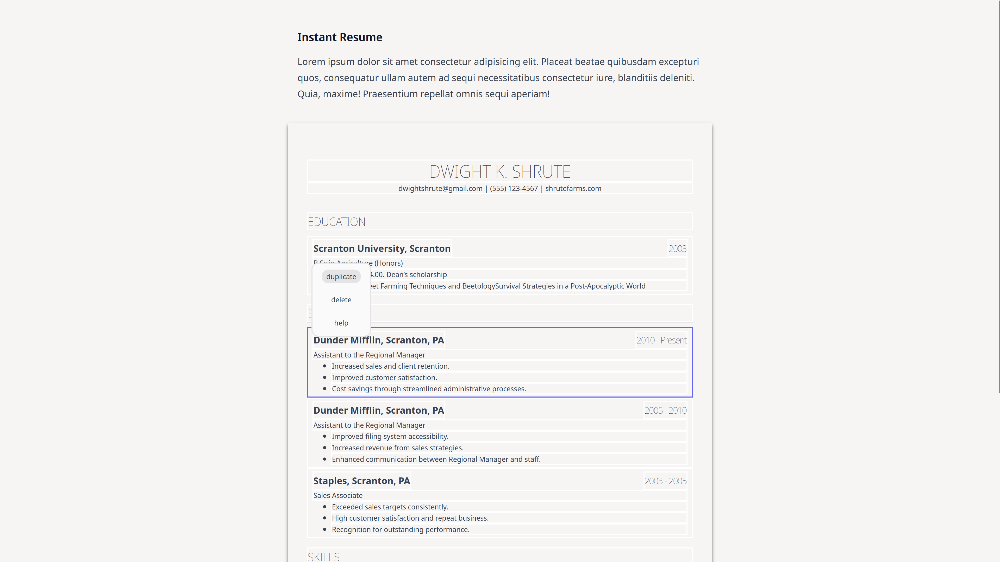

# Instant Resume

Create resumes instantly. Try it [here](https://www.youtube.com/watch?v=dQw4w9WgXcQ). (Still in the works...)



## Features

- Professional templates : No flashy graphics, a limited template set (thanks to [/resumes](https://www.reddit.com/r/resumes/) subreddit) that work IRL.
- Editable : Choose a template, and edit the text directly. You don't need to fill your info in text fields over multiple pages.
- No signup : Once done editing, hit the print button to receive your PDF without any fuss.

## Build Instructions

To build and run the app on your local machine, follow the instructions below:

### Prerequisites

- [Node.js](https://nodejs.org) and npm (Node Package Manager) must be installed on your machine.

### Installation

1.  Clone the repository or download the source code.
2.  Open a terminal or command prompt and navigate to the project directory.
3.  Run the command `npm install`.

### Development Build

To build and run the app in development mode, use the following command:

```sh
npm run dev
```

This command will start the development server. Navigate to [localhost:5173](http://localhost:5173/) on your browser. Any changes you make to the source code will automatically trigger a rebuild, and the browser will refresh to reflect the changes.

### Production Build

To build the app for production, use the following command:

```sh
npm run build
```

This command will create an optimized production build of the app in the dist or build directory. The compiled files can then be deployed to a web server or used locally in a web browser.
